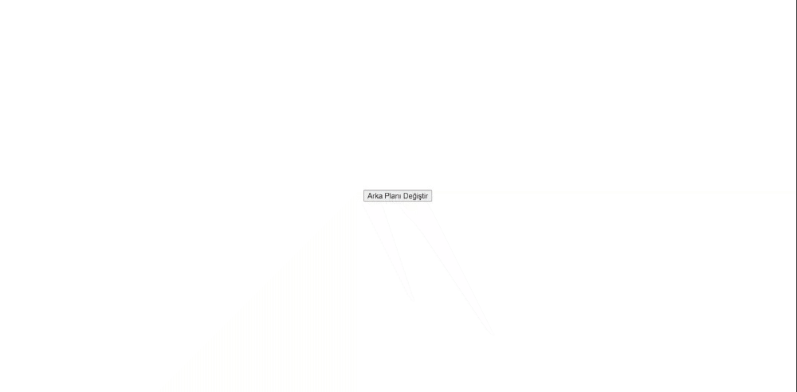

<h1> # Javascript-Projesi </h1>

<h2>Proje Hakkında Detaylar </h2>

Bu proje JavaScript öğrenimi için yapılmıştır.
Projede JS kullanılarak body arka plan rengi, div arka plan rengi, div border renkleri ve text rengi değişikliği yapılmıştır.

<h3> Görünüm </h3>

